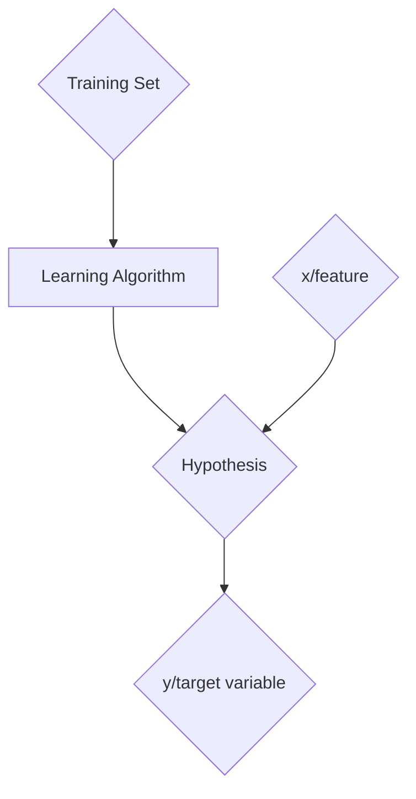

## Supervised Learning 

How can you represent a hypothesis? Well mathemtically it is simply represented in a function format $h: x \to y$: 
$$h_{\theta}(x) = \theta_{0} + \theta_{1}x$$
The way you should look at supervised learning is that you have a training set alongside your training algorithm. Now you have this hypothesis, and you want to ger your x/feature to produce your y/target variable.


Futhermore, we can continue to elaborate on the hypothesis function. Formally, we can read it as the following: $$h(x) = \sum_{j = 0}^{n} \theta_{j}x_{j} \; ; x_{0} = 1$$ You might be asking yourself what do these variables represent, what is $\theta$ here, what is $x$(I said what this what earlier but we can restate it)? Worry not as your questions will be answered. Before I can explain to you what they are, I need to tell you how they are represented. They are represented in matrix form with $m$ being the number of training examples (rows). Thus, we can represent $\theta$ and $x$ as: $$\theta = \begin{bmatrix} \theta_{0} \\ \theta_{1} \\ \vdots \\ \theta_{n} \end{bmatrix},\; x = \begin{bmatrix} x_{0} \\ x_{1} \\ \vdots \\ x_{n} \end{bmatrix}$$ So, as mentioned earlier $x$ is the features or "input" to your hypothesis. $\theta$ are the parameters of the learning algorithm. You want to choose a $\theta$ such that $h(x) \approx y$ for each training example. Just to make it clear, $(x, y)$ is one training example and $(x^{i}, y^{i})$ is the $i$th training example. We can now introduce the **cost function**. The cost function is given by the following: $$J(\theta) = \frac{1}{2}\sum_{i = 1}^{n}(h_{\theta}(x^{i}) - y^{i})^{2}$$ To explain what it is, the cost function is a measure of how wrong the model is in terms of its ability to measure the relationship between $x$ and $y$. If this formula looks familiar its because it has the square error formula in it. The mean square error (MSE) is used to check how close forecasts are to actual values. Thus, a lower MSE means that the forecasted values are close to actual. Our **GOAL** is to minimize $\theta$ for $J(\theta)$.

## Gradient Descent
So what is this word above? Well to put it simply, before explaining it mathematically, gradient descent is an iterative optimization algorithm to find the local minimum of a function. Basically it finds the best parameters that minimize the model's cost function. As you saw earlier you always want the smallest number to be given by the cost function. Mathematically the generalized form is: $$ \theta_{j} := \theta_{j} - \alpha \frac{\partial}{\partial \theta_{j}} J(\theta) $$ Where := means to assign to and $\alpha$ is the learning rate. The goal of this is to continue to change the value of $\theta$ to reduce $J(\theta)$. Therefore, the gradient descent algorithm is: $$  \theta_{j} := \theta_{j} - \alpha \sum_{i = 1}^{m}(h_{\theta}(x^{i}) - y^{i})x^{i}_{j}$$ which will repeat until convergence. Just a thing to keep in mind that too large of a learning rate can overshoot and pass the minima, but also if it is too small if will take a very long time to reach the minima. Just for reference a value of 0.1 or 0.01 is a good starting point, but you should try multiple values as all problems are different. A typical set up when writing the code would probably look someting like this: 
```
Repeat{
	for i = 1 to m {
	theta_j := \theta_j + alpha J(theta)
	}
}
for every j
```
Obviously this code is not actual code but its just an example. The things we have talked about so far can also be called **batch gradient descent** where you look at all the examples as a batch. Although, if you have a large data set it can be very computationally heavy which is a big disadvantage. Although there is a work around this which is **stochastic gradient descent**. SGD will never get your exact value of $\theta$, but it will get pretty close. This is a really good option when dealing with lots of data. It fights the problem we had with batch gradient descent. If you plot $\theta_{j}$ vs $t$ you will eventually get to a point where your value of $\theta$ will no longer be decreasing significantly and thats when you know your relative minima is within that value range. 

## The Normal Equations
So far we have been talking about iterating multiple times until we got to the minimum. You might be asking yourself, "is there a way to just skip all of that and get the exact value right away?", and I would answer your question with, well is it a linear regression problem? If so, yes, if not well you are out of luck. If you are working on a linear regression problem you can use the normal equations. They are given by the following: $$X^{T}X \theta = X^{T} \vec{y}$$ While you might not fully grasp what this means right now, we will walk through the steps with some minimal reminders of the fundamentals of linear algebra. So to quickly recap we know that the trace of a matrix is just the sum of the diagonals. The gradient of a matrix is given by: $$\nabla_{A}f(A) = \begin{bmatrix} \frac{\partial f}{\partial A_{11}} & \cdots & \frac{\partial f}{\partial A_{1m}} \\ \vdots & \ddots & \vdots \\ \frac{\partial f}{\partial A_{m1}} & \cdots & \frac{\partial f}{\partial A_{mn}} \end{bmatrix}$$ Now you can imagine this but for the cost function and $\theta$. It would look like $\nabla_{\theta} J(\theta)$. There are many trace properties that you should know but that is something that shold of been covered in your linear algebra course. Now we know how the cost function looks represented as a matrix so we can begin to work our way to explain the normal equations which was presented above. If you can intuitevely think about what our new cost function is going to be like from seeing the normal equations maybe you imagine something like this: $$J(\theta) = \frac{1}{2} (X\theta - \vec{y})^{T}(X\theta - \vec{y})$$ in which case you would be correct. Our variables presented above take a matrix form, and for the sake of my sanity, I will leave that as an exercise for you to derive if your curiosity so asks you to. Thus, coming to a conclusion that the final result we want is to be able to get a value of $\theta$ that minimizes $J(\theta)$ using the following formula: $$\theta = (X^{T}X)^{-1}X^{T}\vec{y}$$ 