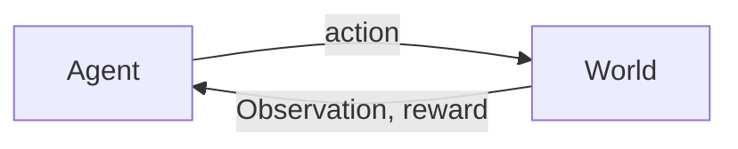

 # Overview of Reinforcement Learnings
* **Optimization**
	* Find an optimal way to make decision. Explicit notion of decision
* **Delayed Consequences**
	* Decisions can impact things much later. When you plan for RL you need to put into account long-term ramifications. While learning having a temporal credit assignment can be hard to produce.
* **Exploration** 
	* Learning about the world making decisions, censored data (only getting a reward for a decision made), and desicions impacting what we learn about.
# Sequential Decision Process: Agent & the World in Discrete Time

Observation, rewards and actions will all be functions of time. Thus, for every time step, $t$, there is an action $a_{t}$, world will update given the action, which will omit an observation, $o_{t}$, and give a reward, $r_{t}$. Following that, the agent will receieve an observation and reward. The proces coninues. Obviously, or maybe not so obvious, there will be a **history** of these past observations, actions, and rewards in for the form of a sequence. History can easily be represented as, $h_{t} = (a_{1}, o_{1}, r_{1}, \dots, a_{t}, o_{t}, r_{t})$ which then an agent will choose an action based on previous history. We can introduce **state** which is information assumed that can determine what will happen next. This is a function of history and is given by: $$s_{t} = (h_{t})$$ How can you represent the agent internally? What do you mean by this? Its the what the agent (our algorithm) uses to make decisions about how to act. This is represented similar to how the state is represented, as a function of history. This includes meta information like:
* state of the algorithm (computations executed)
* decisions process (decisions left until episode ends)
**Markove Assumptions** needs to be introducted here. What does it mean to be **Markov**? A Markov chain(process) describes a sequence of possible events in which the probability of each event depemends on on the state attained in the previous event. Thus, what is our information state? The sufficient statistic of history. Then we can say that $s_{t}$ is Markov iff: $$p(s_{t + 1} | s_{t}, a_{t}) = p(s_{t + 1} | h_{t}, a_{t}) $$ The future is independent of past, given the present. The Markov assumption is popular because it can always be satisfied. Setting state as history will always be Markov. When in practice you can almost always assume that your most recent observation is sufficient statistics of history, $s_{t} = o_{t}$.  Your state represenation has big implications for:
* Computational complexity
* Data required
* Resulting performance
Components of an RL algorithm will almost always include one or more of the following:
* Model
* Policy
* Value Function
# Markov Decision Process
## Model
Formally, an MDP is a discrete-time stochastic control process. It gives the framework for modeling decision making in situations where outcomes are partly random and partly under the control of a decision maker. Agent's representation of how world changes is given by the agent's action. The transition (dynamics) model will predict the next agent state and is given by: $$p(s_{t + 1} = s' | s_{t} = s, a_{t} = a)$$ and the Reward model will predct the immediate reward: $$ r(s_{t} = s, a_{t} = a) = \mathbb{E}[r_{t} | s_{t} = s, a_{t} = a] $$
## Policy
What is policy? Well it is denoted by $\pi$, which will definitely be hard not to associate it with 3.14, but over time you will get used to it. Thus, $\pi$ will determine how the agent chooses actions. Another thing to mention is that $\pi$ is a mapping from states to action which we know formally looks like $\pi: S \to A$. The deterministic policy is given by: $$\pi(s) = a$$ and the Stochastic policy is given by: $$\pi(a | s) = Pr(a_{t} = a | s_{t} = s) $$
## Value Function
The value function, $V^{\pi}$, is the expected discounted sum of future rewards under a particular policy $\pi$ which is given by: $$ V^{\pi}(s_{t} = s) = \mathbb{E}_{\pi}[r_{t} + \gamma r_{t + 1} + \gamma^{2}r_{t + 2} + \gamma^{3} r_{t + 3} + \cdots | s_{t} = s] $$
We have a discount factor that is denoted by $\gamma$ which will weigh the immediate vs. future rewards. A large $\gamma$ implies we weigh delayed/long term rewards more. A $\gamma = 0$ will only value immediate rewards.  This function can quantify how good or bad states and actions. We will be able to decide how to act by comparing policies.
# RL Agents
There are different types of agents. An agent is just a word used to represent the learning algorithm. It is the component that makes the decision of what action to take. We have two types:
* Model-Based: which explicitly do have a model, although they may or may not have the other two components ($\pi$ and $V^{\pi}$).
* Model-free: Explicitly does have $\pi$ and/or $V^{\pi}$, but does not have a model.
Evaluation: estimates the expected rewards from following a given policy.
Control: Optimizes to find the best policy.