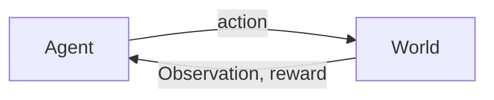

 ## Overview of Reinforcement Learnings
* **Optimization**
	* Find an optimal way to make decision. Explicit notion of decision
* **Delayed Consequences**
	* Decisions can impact things much later. When you plan for RL you need to put into account long-term ramifications. While learning having a temporal credit assignment can be hard to produce.
* **Exploration** 
	* Learning about the world making decisions, censored data (only getting a reward for a decision made), and desicions impacting what we learn about.
## Sequential Decision Process: Agent & the World in Discrete Time

Observation, rewards and actions will all be functions of time. Thus, for every time step, $t$, there is an action $a_{t}$, world will update given the action, which will omit an observation, $o_{t}$, and give a reward, $r_{t}$. Following that, the agent will receieve an observation and reward. The proces coninues. 